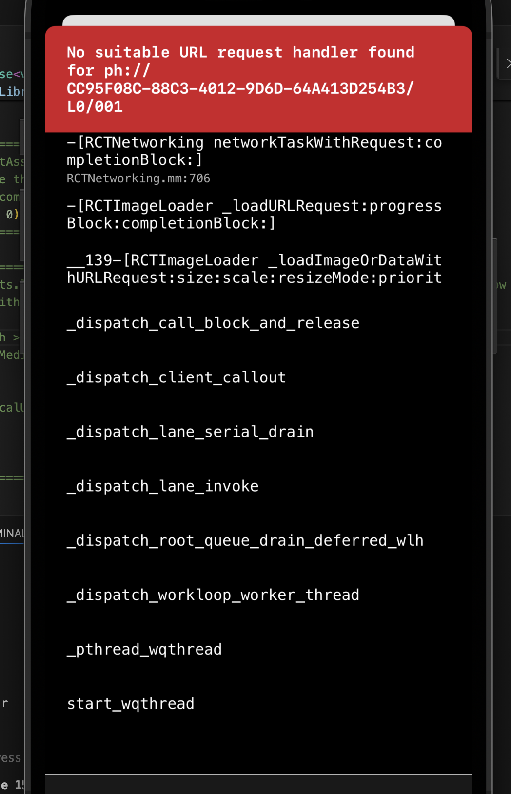

## Get started

1. Install dependencies

   ```bash
   npm install
   ```

2. Start the app

   ```bash
    npx expo start
    ```
  


## How to reproduce error

1. Open iphone simulator
2. Click button "Get photo"
3. it shows error

```
No suitable URL request handler found for ph://CC95F08C-88C3-4012-9D6D-64A413D254B3/L0/001

-[RCTNetworking networkTaskWithRequest:completionBlock:]
    RCTNetworking.mm:706
-[RCTImageLoader _loadURLRequest:progressBlock:completionBlock:]
__139-[RCTImageLoader _loadImageOrDataWithURLRequest:size:scale:resizeMode:priority:attribution:progressBlock:partialLoadBlock:completionBlock:]_block_invoke.159
_dispatch_call_block_and_release
_dispatch_client_callout
_dispatch_lane_serial_drain
_dispatch_lane_invoke
_dispatch_root_queue_drain_deferred_wlh
_dispatch_workloop_worker_thread
_pthread_wqthread
start_wqthread

```



## Workaround

1. comment `if (photoData.assets.length > 0) setPhotoUri(photoData.assets[0].uri);` from `App.tsx`
2. uncomment this block of code in `App.tsx`
```js
if (photoData.assets.length > 0) {
  const assetInfo = await MediaLibrary.getAssetInfoAsync(
    photoData.assets[0].id
  );
  setPhotoUri(assetInfo.localUri || assetInfo.uri);
} else {
  setIsEmpty(true);
}
```

